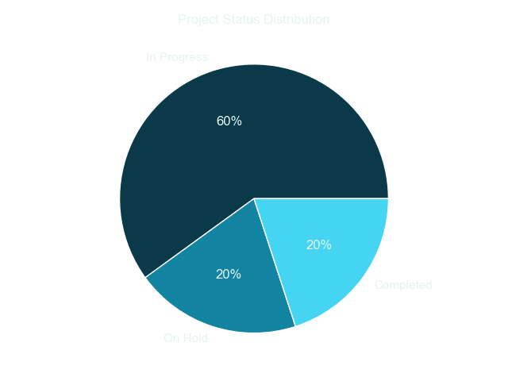
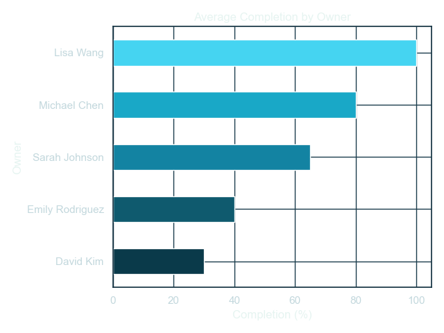
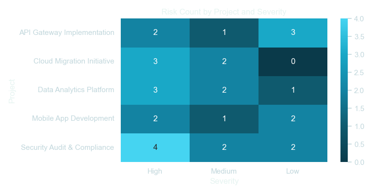
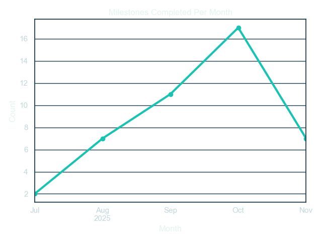

AI SaaS Project Tracker and KPI Dashboard
A compact yet realistic platform that simulates enterprise software delivery tracking and analytics.
It allows users to create projects, log milestones and risks, compute KPIs, export analytics data, and generate narrative summaries for stakeholder updates.

1. Objective
The goal of this project is to provide a unified system to:

Track project progress and milestone completion

Manage risks with severity and mitigation details

Analyze delivery KPIs (on-track %, delays, high-risk counts)

Generate Power BI and Jira-compatible exports

Produce AI-powered summary reports automatically

This project demonstrates full-stack development, data analytics, and process visualization — closely aligned with Rubrik’s focus on engineering execution visibility and performance metrics.

2. Tech Stack
Layer	Technologies
Backend	Python (Flask) – REST APIs and server pages
Database	SQLite with SQLAlchemy ORM
Frontend	HTML, Bootstrap, JavaScript
Charts	Plotly (in-app charts), Matplotlib, Seaborn (offline KPI visualizations)
AI Summaries	Hugging Face Transformers (google/flan-t5-small) + Rule-based fallback
Data Integration	CSV exports for Jira import and Power BI analytics
Utilities	Pandas, Dateutil, Requests
3. Key Features
Project Management
Full CRUD support for projects

Deadlines, owners, and progress tracking

Automatic recalculation of project progress from milestones

Milestone Workflow
Status lifecycle: Pending → In Progress → Completed → Delayed

Automatic update of project progress based on milestone completion

Risk Register
Define risks with name, severity (Low / Medium / High), mitigation plan, and status (Open / Mitigated / Closed)

Visualized through heatmaps and severity distribution charts

KPI Dashboard
Key performance indicators:

On-Track %

Average Delay %

High Risk Count

Average Project Completion

Milestone Completion Rate

Exports
Power BI-friendly normalized tables: projects.csv, milestones.csv, risks.csv

Jira-compatible import CSVs with Work Item ID, Parent ID, and Work Type

AI Summary
Executive-style summary reports generated on demand

Uses local Hugging Face model (flan-t5-small) when available, or a rule-based fallback

4. How to Run Locally
# 1. Create a virtual environment (optional)
python -m venv .venv
.venv\Scripts\activate  # (on Windows)

# 2. Install dependencies
pip install -r requirements.txt

# 3. Install optional chart dependencies
pip install matplotlib seaborn

# 4. Initialize database and seed data
python init_db.py
python sample_data.py

# 5. Run the application
python app.py
Then open your browser and visit:
http://localhost:5000

5. Power BI and Offline KPI Visuals
Generate normalized CSVs for Power BI or analyze offline KPIs locally.

# Export CSVs for Power BI
python powerbi_csv_export.py
# Files saved under /docs

# Generate charts and animated KPIs
python kpi.py
# Charts saved under /charts
Offline Visualization Examples
Visualization	Description
status_distribution.png	Overall project status distribution
status_by_owner.png	Project statuses grouped by owner
completion_by_owner.png	Completion rates by owner
completion_vs_days_remaining.png	Correlation between completion % and remaining time
milestones_completed_over_time.png	Timeline trend of milestone completion
risk_severity.png	Distribution of risks by severity
risk_heatmap.png	Heatmap of risks by project and severity
6. Jira Integration via CSV
Generate a CSV for Jira issue import:

python jira_csv_export.py
In Jira:
Go to Issues → Import Issues from CSV, and map the following columns:

Work Item ID

Work Type

Parent ID

Summary / Description

7. AI Summaries
Inside each project’s detail page, use the AI Summary tab to generate executive updates.

Mode	Description
AI-Model Mode	Uses Hugging Face google/flan-t5-small (requires transformers and torch)
Rule-Based Mode	Automatically generates summaries when models are unavailable
These summaries simulate the kind of executive or sprint-review updates used in real product organizations.

8. Folder Structure Overview
AI-SaaS-Tracker/
│
├── app.py                     # Flask server and API endpoints
├── models.py                  # SQLAlchemy ORM models
│
├── static/                    # CSS, JS, frontend assets
├── templates/                 # HTML templates
│
├── docs/                      # Power BI CSV exports
├── charts/                    # Offline KPI visualizations
│
├── requirements.txt
└── ProjectReport.pdf          # Full technical report with visuals
9. Security and Future Roadmap
Role-based access control for multi-user environments

Real-time alerts for overdue milestones and high risks

Live API connectors for Jira and Power BI

Enhanced AI for sprint reviews and stakeholder briefings

Automated performance analytics and continuous improvement metrics

10. Author Notes
This repository demonstrates:

Full-stack development and structured backend design

Analytics-driven dashboards and KPI visualization

Practical integration mindset (Jira, Power BI, AI summaries)

End-to-end delivery thinking suitable for program and product management roles

Author: Sreevastha Thotamsetty
GitHub: sreevastha

11. Reference Screenshots
Embed your visuals here (GitHub will render them):

### Project KPI Visualizations

✅ Summary
The AI SaaS Project Tracker and KPI Dashboard merges software delivery management with analytics and AI insights.
It highlights the ability to design, execute, and analyze engineering programs effectively — a key capability for Rubrik’s Engineering Program Intern role.
